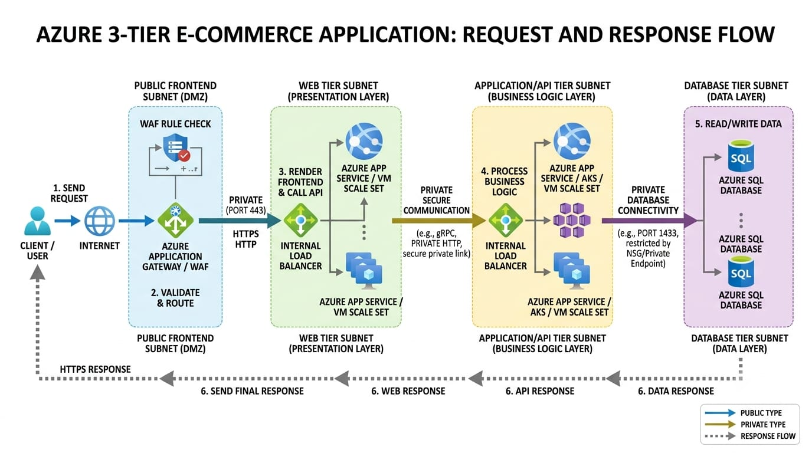

# Architecture Design

## Overview

The proposed solution uses a 3-tier architecture to separate the application into independent logical layers.

The three layers are:

1. Web Tier
2. Application Tier
3. Database Tier

This separation improves security, maintainability, scalability, and troubleshooting.

---

## Architecture Flow

Internet Users
      |
      v
Azure Application Gateway
      |
      v
Web Application Firewall
      |
      v
Web Tier
      |
      v
Application Tier
      |
      v
Azure SQL Database

Supporting services such as Microsoft Entra ID, Azure Key Vault, Azure Monitor, Log Analytics, Application Insights, and Azure Backup provide security, identity, monitoring, and recovery capabilities.

---

## Web Tier

The Web Tier represents the customer-facing application layer.

Incoming requests are received through Azure Application Gateway.

The Web Application Firewall provides an additional security layer before traffic reaches the application.

## Responsibilities

Serve the web application

Handle user-facing requests

Communicate with the Application Tier

Remain isolated from direct database access

---

## Application Tier

The Application Tier contains backend services and APIs.

This layer processes application logic and handles communication between the Web Tier and Database Tier.

## Responsibilities

Process business logic

Handle API requests

Validate application operations

Communicate with the database

Return application responses to the Web Tier

The Application Tier should not be directly exposed to internet users.

---

## Database Tier

The Database Tier uses Azure SQL Database to store application data.

Database access is designed through private connectivity.

## Responsibilities

Store application data

Process database queries

Maintain data integrity

Provide database availability and recovery capabilities

The database should not be directly accessible from the public internet.

---

## Application Gateway

Azure Application Gateway acts as the main entry point for application traffic.

It provides:

Application-level traffic routing

Backend health monitoring

HTTPS termination capabilities

Integration with Web Application Firewall

Traffic is forwarded only towards the configured healthy backend resources.

---

## Web Application Firewall

Web Application Firewall provides protection for the public-facing application.

It can help detect and block common web-based attacks before requests reach the application.

WAF activity can also be reviewed during troubleshooting when legitimate users report access problems.

---

## Network Isolation

The application components are logically separated using Azure networking.

The intended structure is:

Virtual Network
│
├── Web Subnet
│
├── Application Subnet
│
└── Database Connectivity

Network Security Groups are used to restrict unnecessary communication between these layers.

---

## Security Boundaries

The architecture uses multiple security boundaries:

Internet
   |
   v
Application Gateway + WAF
   |
   v
Web Tier
   |
   v
Application Tier
   |
   v
Private Database Connectivity
   |
   v
Azure SQL Database

Each layer has a specific role and should only communicate with the components required for its operation.

---

## Identity and Security Services

The architecture includes Microsoft Entra ID for identity management and Azure RBAC for authorization.

Managed Identity can be used by supported Azure services to access other resources without storing credentials directly in application configuration.

Azure Key Vault is included for managing sensitive information such as secrets, certificates, and credentials.

---

## Monitoring Services

Azure Monitor provides infrastructure and platform monitoring.

Log Analytics provides centralized log collection and analysis.

Application Insights provides application-level observability such as request performance and exceptions.

These services support troubleshooting across the different application layers.

---

## High Availability Considerations

The architecture considers high availability through:

Multiple application instances

Health checks

Traffic distribution

Auto-scaling considerations

Availability Zones where supported

Azure SQL availability capabilities

If an application instance becomes unavailable, traffic can be directed towards healthy instances.

---

## Disaster Recovery Considerations

The design considers:

Database backups

Recovery procedures

Azure Backup where applicable

Recovery objectives

Disaster recovery planning

RTO and RPO values should be defined according to actual business requirements.

---

## Architecture Benefits

The proposed architecture provides:

Separation of application responsibilities

Improved network isolation

Reduced database exposure

Centralized monitoring

Controlled identity and access

Better troubleshooting visibility

Scalability considerations

High availability considerations

Disaster recovery planning

Cost awareness

---

## Design Principle

The architecture follows a layered approach:

Public Access
      |
      v
Secure Entry Point
      |
      v
Web Layer
      |
      v
Application Layer
      |
      v
Private Data Layer

This structure provides a clear separation of responsibilities and makes the environment easier to secure, monitor, troubleshoot, and maintain.
