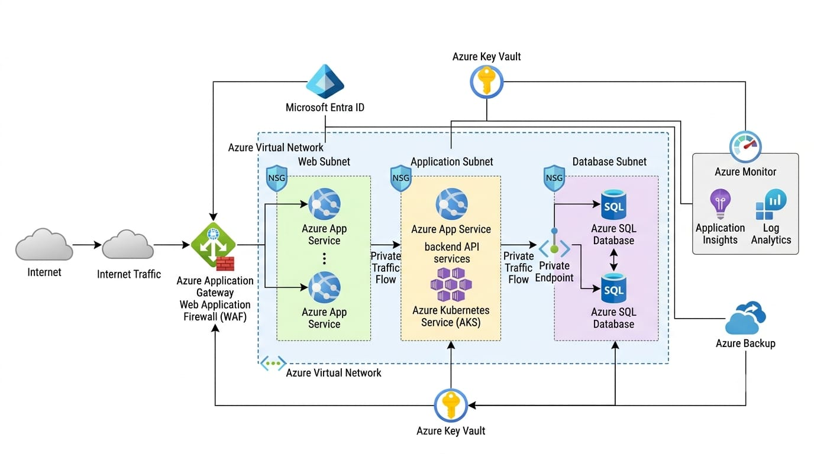

# Network Design

## Overview

The architecture uses an Azure Virtual Network to provide logical network isolation between the different application components.

The network is divided into separate areas for the Web Tier, Application Tier, and Database connectivity.

---

## Virtual Network

The Azure Virtual Network provides the private networking foundation for the application.

It allows application components to communicate using controlled network paths.

The proposed network structure is:

Azure Virtual Network
│
├── Web Subnet
│
├── Application Subnet
│
└── Database Connectivity

---

## Web Subnet

The Web Subnet contains the web-facing application components.

Traffic reaching the application from the internet is expected to pass through Azure Application Gateway and Web Application Firewall before reaching the Web Tier.

The subnet should only allow the network traffic required by the web application.

---

## Application Subnet

The Application Subnet contains backend application services and APIs.

The Application Tier receives requests from the Web Tier and processes application logic.

Direct internet access to the Application Tier is not required.

---

## Database Connectivity

Azure SQL Database is accessed through private connectivity.

A Private Endpoint can be used to provide private network access to the database service.

The intended design avoids exposing the database directly to the public internet.

---

## Network Security Groups

Network Security Groups are used to control inbound and outbound network traffic.

The rules should follow the principle of least access.

The intended communication pattern is:

Internet
   |
   v
Application Gateway + WAF
   |
   v
Web Subnet
   |
   v
Application Subnet
   |
   v
Private Endpoint
   |
   v
Azure SQL Database

Only the required communication between application layers should be permitted.

---

## Traffic Flow

A typical request follows this path:

1. A user sends an HTTPS request from the internet.

2. The request reaches Azure Application Gateway.

3. Web Application Firewall evaluates the request.

4. Valid traffic is forwarded to the Web Tier.

5. The Web Tier communicates with the Application Tier.

6. The Application Tier accesses Azure SQL through private connectivity.

7. The database returns the requested information.

8. The response travels back through the application layers to the user.

---

## Network Security Approach

The network design follows these principles:

Separate application layers

Minimize public exposure

Restrict unnecessary traffic

Use private connectivity for database access

Apply Network Security Groups

Allow only required communication paths

Monitor network-related activity

---

## DNS Considerations

Private connectivity requires appropriate DNS resolution.

If a Private Endpoint is used, the application must be able to resolve the database service name to the appropriate private IP address.

During troubleshooting, DNS resolution should therefore be checked when the application cannot connect to the database.

---

## Network Troubleshooting

When connectivity problems occur, the investigation can follow:

Check Application Status
        |
        v
Check Application Gateway
        |
        v
Check Backend Health
        |
        v
Check NSG Rules
        |
        v
Check Private Endpoint
        |
        v
Check DNS Resolution
        |
        v
Check Database Availability
        |
        v
Review Logs and Metrics

This approach helps identify whether the problem is related to routing, security rules, private connectivity, DNS, or the destination service.

---

## Network Design Goals

The network design aims to provide:

Logical isolation

Controlled traffic flow

Reduced public exposure

Secure database connectivity

Easier troubleshooting

Clear separation between application layers

The network architecture supports the overall security, availability, and operational requirements of the 3-tier application.
