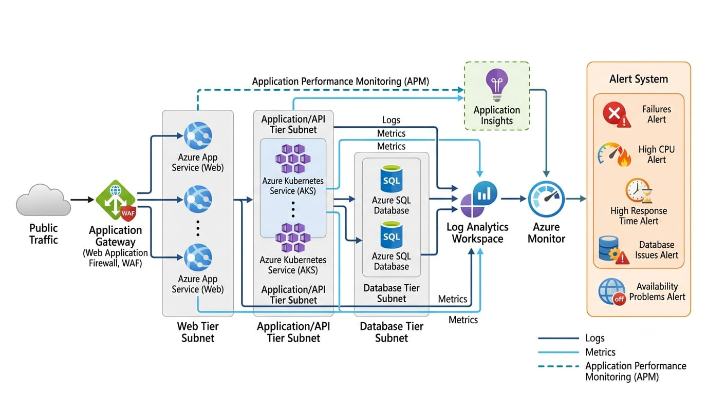

# Monitoring & Observability

## Overview

Monitoring and observability are important for maintaining the health and reliability of the Azure 3-tier application.

The architecture uses Azure Monitor, Log Analytics, and Application Insights to collect and analyze information from different application components.

---

## Monitoring Objectives

The monitoring design aims to provide visibility into:

- Application availability
- Resource utilization
- Application performance
- Backend health
- Database performance
- Application errors
- Network-related issues
- Service health

---

## Azure Monitor

Azure Monitor provides monitoring capabilities for Azure resources and applications.

It can be used to review:

- Metrics
- Resource health
- Alerts
- Monitoring data

Azure Monitor helps identify abnormal resource behavior and potential service issues.

---

## Log Analytics

Log Analytics provides a centralized location for collecting and analyzing logs.

Logs from supported resources can be queried to investigate issues and identify patterns.

Example investigation areas include:

- Application errors
- Access activity
- Network-related events
- Resource activity
- Service failures

---

## Application Insights

Application Insights provides application-level monitoring.

It can help track:

- Request performance
- Response times
- Application exceptions
- Failed requests
- Application availability

This information can help support engineers determine whether an issue is occurring within the application layer.

---

## Monitoring Architecture

Application Gateway
        |
        v
     Web Tier
        |
        v
 Application Tier
        |
        v
 Azure SQL Database
        |
        |
        +--------------------+
                             |
                             v
                       Azure Monitor
                             |
                 +-----------+-----------+
                 |                       |
                 v                       v
           Log Analytics         Application Insights

---

## Monitoring Areas

Component	Monitoring Areas

Application Gateway	Requests, errors, backend health
Web Tier	CPU, memory, availability
Application Tier	API failures, latency
Database	Connections, performance
Application	Exceptions, response time

---

## Metrics

Metrics can be used to identify resource and performance issues.

Examples include:

CPU utilization

Memory utilization

Request count

Response time

Error rate

Database performance indicators

Backend health

Metrics should be reviewed together with logs rather than relying on a single measurement.

---

## Logs

Logs provide detailed information about events occurring within supported services and applications.

During troubleshooting, relevant logs should be reviewed based on the affected layer.

For example:

User Issue
    |
    v
Application Gateway Logs
    |
    v
Application Logs
    |
    v
Database / Connectivity Logs

---

## Alerts

Alerts can be configured for conditions that require attention.

Possible alert conditions include:

High resource utilization

Increased response time

Application errors

Backend health failures

Database connectivity problems

Availability issues

Alerts should be based on meaningful operational conditions to reduce unnecessary notifications.

---

## Application Availability

Application availability should be monitored from the user-facing perspective as well as from individual Azure resources.

If users report that the application is unavailable, the investigation should begin by identifying which layer is affected.

---

## Troubleshooting with Monitoring

A support engineer can use monitoring data to narrow down the problem.

Example:

Application Is Slow
        |
        v
Check Application Insights
        |
        v
Check Response Time
        |
        v
Check Application Resources
        |
        v
Check API Latency
        |
        v
Check Database Performance
        |
        v
Identify Affected Layer

---

## Incident Investigation

Monitoring data should be used as evidence during troubleshooting.

The investigation should include:

1. Identify the reported symptom.

2. Determine when the issue started.

3. Check relevant metrics.

4. Review application and resource logs.

5. Compare the issue across application layers.

6. Check recent configuration changes.

7. Identify the most likely cause.

8. Apply a controlled change if required.

9. Validate application behavior.

10. Document the findings.

---

## Observability Benefits

The monitoring design helps provide:

Faster issue identification

Better troubleshooting visibility

Centralized log analysis

Application performance visibility

Resource health awareness

Evidence-based troubleshooting

---

## Monitoring Design Goal

The goal is to maintain visibility across the application:

Collect
   |
   v
Monitor
   |
   v
Analyze
   |
   v
Alert
   |
   v
Investigate
   |
   v
Resolve
   |
   v
Document

Monitoring and observability support the overall reliability and Cloud Support objectives of the project.
