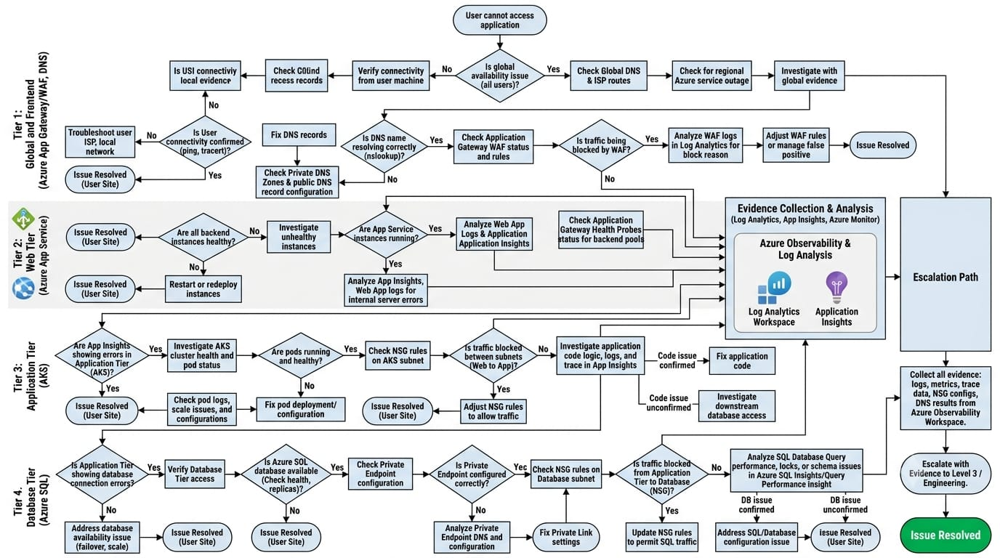

# Troubleshooting Guide

## Overview

This guide describes a practical troubleshooting approach for common issues in the Azure 3-tier web application architecture.

The troubleshooting process focuses on identifying the affected layer, collecting evidence, checking recent changes, and validating the resolution.

---

## Troubleshooting Approach

A typical investigation follows:

Reported Issue
      |
      v
Identify Affected Layer
      |
      v
Check Recent Changes
      |
      v
Review Metrics
      |
      v
Review Logs
      |
      v
Test Connectivity
      |
      v
Identify Root Cause
      |
      v
Apply Controlled Fix
      |
      v
Validate
      |
      v
Document

---

## Scenario 1: Website Is Not Accessible

Reported Symptom

Users report that the website cannot be opened.

Investigation

Start from the public entry point and move through each application layer.

User
 |
 v
Application Gateway
 |
 v
WAF
 |
 v
Web Tier
 |
 v
Application Tier
 |
 v
Database

Checks

1. Confirm whether the issue affects all users or only specific users.

2. Check Application Gateway availability.

3. Review backend health.

4. Check WAF activity.

5. Check Web Tier availability.

6. Review application logs.

7. Check Application Tier health.

8. Check database connectivity.

9. Review Azure Monitor metrics and logs.

10. Check for recent configuration changes.

## Possible Causes

Application Gateway configuration issue

Backend instance unavailable

WAF rule blocking legitimate traffic

Application failure

Network connectivity issue

Database connectivity problem

## Validation

After applying a fix:

Test the application from the user-facing endpoint.

Confirm backend health.

Review application logs.

Confirm that the original symptom is no longer present.

---

## Scenario 2: Application Cannot Connect to Database

Reported Symptom

The application is running, but database operations are failing.

Investigation Flow

Application Tier
      |
      v
Private Endpoint
      |
      v
DNS Resolution
      |
      v
Network Rules
      |
      v
Azure SQL Database

Checks

1. Confirm the application service is running.

2. Check the configured database endpoint.

3. Verify DNS resolution.

4. Check Private Endpoint status.

5. Review network configuration.

6. Check Network Security Group rules where applicable.

7. Verify database availability.

8. Review application logs for connection errors.

9. Check recent network or database configuration changes.

## Possible Causes

Incorrect database configuration

Private Endpoint issue

DNS resolution problem

Network rule blocking traffic

Database availability issue

Application configuration problem

## Validation

After correcting the issue:

Confirm successful database connectivity.

Test an application operation that requires database access.

Review application logs.

Confirm that database-related errors have stopped.

---

## Scenario 3: Users Experience Slow Application Response

Reported Symptom

The application is available but response times are higher than expected.

Investigation Flow

Slow Application
      |
      v
Application Insights
      |
      v
Request Performance
      |
      v
Web Tier
      |
      v
Application Tier
      |
      v
Database Performance

Checks

1. Review Application Insights request performance.

2. Check failed requests and exceptions.

3. Review application response times.

4. Check CPU and memory utilization.

5. Check backend health.

6. Review API latency.

7. Check database performance indicators.

8. Review recent application or configuration changes.

9. Compare current behavior with normal operating patterns.

## Possible Causes

Increased traffic

Resource saturation

Slow API processing

Database performance issue

Application-level problem

Recent configuration change

## Validation

After the corrective action:

Confirm response times have improved.

Check application errors.

Review resource utilization.

Confirm normal application behavior.

---

## Scenario 4: User Cannot Access an Azure Resource

Reported Symptom

A user reports that they cannot perform an operation on an Azure resource.

Investigation Flow

Access Issue
     |
     v
Identify User
     |
     v
Microsoft Entra ID
     |
     v
RBAC Assignment
     |
     v
Resource Scope
     |
     v
Permission
     |
     v
Recent Changes

Checks

1. Confirm the user's identity.

2. Verify that the account can authenticate.

3. Check assigned Azure RBAC roles.

4. Verify the scope of the role assignment.

5. Check inherited permissions.

6. Review recent access changes.

7. Confirm that the requested operation is allowed by the assigned role.

## Possible Causes

Missing RBAC role

Incorrect role

Incorrect resource scope

Permission change

Managed Identity configuration issue

## Validation

After correcting access:

Ask the user to retry the operation.

Confirm the expected permission is available.

Verify that unnecessary permissions were not granted.

---

## General Troubleshooting Checklist

When investigating an incident:

Identify the reported symptom

Determine the affected application layer

Check whether the issue is widespread

Review recent changes

Check service health

Review metrics

Review logs

Check network connectivity

Check identity and access

Identify the most likely root cause

Apply the smallest appropriate change

Validate the result

Document the investigation

---

## Evidence Collection

Troubleshooting decisions should be based on evidence.

Useful evidence can include:

Error messages

Application logs

Application Gateway logs

Application Insights data

Azure Monitor metrics

Resource health information

Network configuration

RBAC assignments

Recent configuration changes

The evidence should be recorded as part of the incident documentation.

---

## Escalation

If the issue cannot be resolved within the support scope, the engineer should escalate with useful technical information.

The escalation should include:

Problem description

Affected resource

Time of occurrence

Investigation performed

Relevant logs or error messages

Configuration changes identified

Actions already attempted

Current impact

Expected next action

---

## Troubleshooting Principle

The main troubleshooting principle is:

Do Not Guess
     |
     v
Collect Evidence
     |
     v
Narrow the Scope
     |
     v
Identify the Affected Layer
     |
     v
Fix
     |
     v
Validate
     |
     v
Document

This approach helps make troubleshooting more structured, repeatable, and support-focused.
